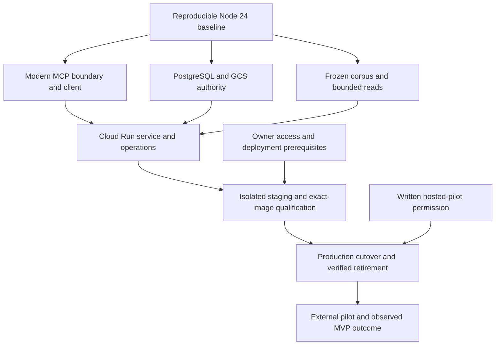

> Historical planning record: the [confirmed product scope](product-scope.md) supersedes conflicting product requirements and Customer milestones. Runtime evidence and release gates retain their recorded limits.

# LexCerta MVP route

The canonical decision index is [Wayfinder: Reach a trustworthy stateless LexCerta pilot MVP](https://github.com/rubixhacker/LexCerta/issues/23). Its resolution comments govern the plan. This file is a navigation handoff, not a second tracker. The user delegated recommended answers without interviews on September 12, 2026; no customer answers or validation were invented.

The route targets a production-qualified, operator-onboarded developer pilot. Completing the plan does not build, deploy, authorize upstream access, or validate that pilot.

The user's subsequent idle-cost questions prompted a [hosting cost review](research/mvp-hosting-costs.md) and [canonical platform reconciliation](https://github.com/rubixhacker/LexCerta/issues/27#issuecomment-5649573236). The active runtime now targets Cloud Run plus Neon Postgres and existing GCS storage. Direct TLS connectivity is exercised against local PostgreSQL; live Neon suspension, permissions and recovery remain qualification gates. The earlier Cloud SQL research is historical and does not authorize an always-on database purchase.

## Execution order

| Work | Tracker |
| --- | --- |
| Baseline | [Establish a reproducible Node 24 baseline and land reviewed cleanup](https://github.com/rubixhacker/LexCerta/issues/31) |
| Protocol | [Correct the stateless MCP boundary and ship the pinned SDK example](https://github.com/rubixhacker/LexCerta/issues/32) |
| Durable authority | [Port authoritative state and source caching to PostgreSQL and GCS](https://github.com/rubixhacker/LexCerta/issues/33) |
| Evidence | [Freeze the real-opinion corpus and implement bounded source reads](https://github.com/rubixhacker/LexCerta/issues/34) |
| Runtime | [Build the Cloud Run service, operator CLI, and maintenance jobs](https://github.com/rubixhacker/LexCerta/issues/35) |
| Access prerequisites | [Verify owner evaluation access and isolated deployment prerequisites](https://github.com/rubixhacker/LexCerta/issues/36) |
| Staging | [Deliver isolated staging and immutable promotion](https://github.com/rubixhacker/LexCerta/issues/11) |
| Shared-pilot permission | [Record FLP permission for the hosted external pilot](https://github.com/rubixhacker/LexCerta/issues/37) |
| Production | [Cut over production and retire the legacy runtime](https://github.com/rubixhacker/LexCerta/issues/12) |
| Product outcome | [Run the external integrator pilot and record the MVP outcome](https://github.com/rubixhacker/LexCerta/issues/38) |

Start with the baseline. Access discovery and upstream permission can proceed independently when their required external actions are authorized. Protocol, state, and corpus work can proceed independently after the baseline. GitHub's native dependencies are authoritative; claim an issue before execution and preserve existing release approvals.

## Supporting evidence

- [Stateless MCP and the first supported client](research/mvp-stateless-mcp.md)
- [CourtListener constraints and corpus method](research/mvp-courtlistener.md)
- [Cloud Run architecture and operating envelope](research/mvp-cloud-run.md)
- [Domain vocabulary](../CONTEXT.md)
- [Tracker workflow](agents/issue-tracker.md)

These are dated source research and recommendations. Deployed service behavior, actual account access and quotas, written upstream permission, costs under load, and external-user adoption still require the evidence specified in their execution tickets. The baseline cleanup landed in [pull request 22](https://github.com/rubixhacker/LexCerta/pull/22); the execution tickets and their evidence records track subsequent work.
