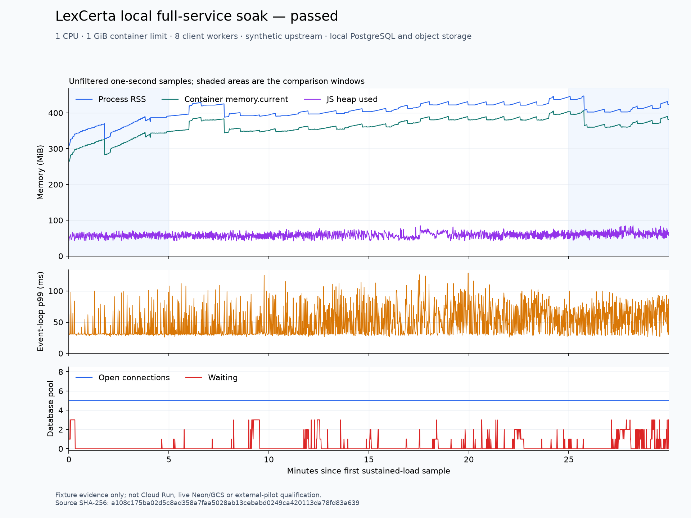

# Full-service fixture soak

The runtime issue requires thirty minutes of sustained fixture traffic after warmup, at one CPU, one GiB and concurrency eight. `scripts/qualify-node-soak.mjs` runs this qualification against a locally built amd64 image and a disposable PostgreSQL 18 fixture. A smoke run checks the harness but can never set `qualified: true`. The [accepted local run](qualification/node-soak-2026-09-12/accepted.json) completed the workload, forced-crash recovery, shutdown and audits.

## Accepted local result

The [complete measurement record](qualification/node-soak-2026-09-12/full-run.json) contains 57,007 measured calls in 1,800.212 seconds, or 31.67 calls/second, with eight concurrent client operations. All fourteen scheduled cases passed. The whole-request deadline returned HTTP 504 after 55.010 seconds; aggregate exhaustion returned an empty 503. The forced crash left its unfinished upstream attempt charged and its opinion unpublished. The restarted process recovered after a real quota-window wait, and SIGTERM drained the subsequent quote.

The run captured 1,794 sustained memory samples. Peak cgroup memory was 408.42 MiB and peak process RSS was 447.55 MiB, under the one-GiB container limit. The first and last five-minute median RSS values were 363.32 and 412.39 MiB, a 49.07-MiB increase within the fixed 64-MiB criterion. The final fifteen-minute RSS slope was approximately -0.0054 MiB/minute. The unfiltered trace shows early growth followed by fluctuations and substantial drops; its measured tail passes the unchanged threshold. No forced collection was used. This is bounded workload evidence, not proof that every possible leak is absent.



Pool size remained at most five, with no pool failures or remaining public connections after shutdown. The persisted key maximum was 240 requests/minute and 7,172/day; upstream audits recorded 25 data attempts, three quota-sync attempts and one deliberately unfinished crash attempt. Every source dispatch had a prior pending SQL reservation, and the rolling upstream caps held. The compressed container log retains the complete sentinel-checked output, including repetitive SDK warnings.

The image index is `sha256:1319a14dd3aa87cd8bbc4f67c523b4c23c0607bca565f517cdd3bdb5172d7291`; its amd64 manifest is `sha256:634d6ed27724c29bf210955e789e63fbbf013a41034f129c7d85146958f59259`. All 77 compiled runtime files matched that image, and all twelve preflight source/fixture pins remained unchanged during the run. Its preflight had 653 passing repository checks and ten container checks. A subsequent complete repository check passed 661 tests after adding the eight recovery-scan checks; that unused scanner module is absent from the soak image. The image has an all-zero local build identifier and is not release eligible. The archive preserves the preflight as historical input, alongside the completed acceptance record.

Use the pinned Node version and the local Docker/PostgreSQL configuration described in [Node runtime](node-runtime.md). Build the current Node output and amd64 Docker image before running. The runner compares every compiled JavaScript file with the image. Give each attempt a new output path; existing artifacts are never overwritten.

```text
node scripts/qualify-node-soak.mjs --smoke --output PATH-TO-NEW-SMOKE-RECORD.json
node scripts/qualify-node-soak.mjs --output PATH-TO-NEW-SOAK-RECORD.json
```

Required environment variables are `LEXCERTA_TEST_IMAGE` and `LEXCERTA_TEST_DATABASE_URL`. Optional `LEXCERTA_TEST_DOCKER_CONFIG` and `LEXCERTA_TEST_DOCKER_HOST` select the local daemon. Database setup rejects remote connection hosts and creates randomly named disposable databases and restricted roles. The runner removes its container, database and temporary files afterward. It saves its JSON record and a separate container log with synthetic-secret and legal-content sentinel checks.

## Workload and measurement

The image supplies the public HTTP lifecycle, key admission, PostgreSQL authority, stateless MCP handler, source adapters and normalization workers. The fixture uses the production Neon adapter with a synthetic certificate and restricted real PostgreSQL credentials, including a 1.2-second simulated cold connection. The CourtListener and GCS wire servers run on the host, outside the constrained container. A small loopback forwarding socket inside the container reaches the object fixture. These are transport fixtures, not provider emulators or live cloud services.

Warmup searches all 100 cached opinions, including one with 24,998 sibling HTML tags near the normalizer's node limit. It also searches a one-MiB HTML opinion with a maximum-length quote in an exactly 64-KiB MCP request body and exercises the 16-MiB aggregate source limit. Another quote must hit the real upstream admission cap without dispatching HTTP.

Eight independent pinned-SDK clients then issue alternating parsing and cached citation verification calls, each with at most four starts per second. Periodic quote searches replace calls in one client lane. This preserves the actual per-key limits of 600/minute and 10,000/day and the shared upstream limits of 3/minute, 30/hour and 80/day. The fixture never increases those limits or rewrites clocks. This measures eight client workers with bounded offered traffic, rather than eight continuously active quote searches that the source quota would prohibit.

The scheduled cases include 100-opinion matching and complete missing results, one-MiB HTML, aggregate source exhaustion, an upstream JSON response one byte above its limit, an upstream JSON response exactly at its limit, a stalled upstream body, a cluster with 101 opinions, cancellation during object I/O, and a 55-second whole-request timeout while individual object operations remain within their own bounds. After the sustained interval, SIGKILL interrupts a dispatched uncached opinion. A fresh process must preserve the charged attempt and absent publication, wait for the real upstream window, and recover. SIGTERM must drain a subsequent active quote.

The runner records request counts and latency distributions, response bytes, source dispatches, PostgreSQL admission/attempt audits, pool occupancy, RSS, heap/external allocations, event-loop delay, and cgroup current/peak memory and OOM counters. Memory sampling does not force garbage collection. Warmup samples are excluded from the sustained interval. Fixture storage and load-generator allocations are outside the service's memory measurements.

Cgroup peak memory includes the container and its descendants; RSS and cgroup accounting can differ. The harness reads named fields from `memory.events` and never resets `memory.peak`. These measurements follow the [Linux cgroup v2 memory interface](https://www.kernel.org/doc/html/latest/admin-guide/cgroup-v2.html).

## Acceptance criteria

These criteria are fixed before accepting a full run:

- At least 1,800 seconds of sustained traffic after warmup, all scheduled cases executed, and eight observed simultaneous client operations.
- Exact expected evidence outcome and search completeness for each applicable case. Expected transport failures must not swallow harness assertions about evidence, privacy or deadlines.
- All requests complete within the 55-second service deadline plus a two-second host observation margin. The explicit whole-request timeout must last at least 54 seconds and return HTTP 504 or close its socket. Aggregate resource exhaustion returns an empty HTTP 503 and cannot be counted as verified evidence.
- No container OOM, cgroup OOM event, or peak reaching the one-GiB limit. No persistent pool error; total pool size at most five, waiting at most eight, and no remaining public database connection after shutdown.
- At least 95% of expected one-second memory samples. The last five-minute median RSS must be within 64 MiB of the first five-minute median, and the RSS slope over the final fifteen minutes must be no more than one MiB per minute. A violation requires investigation; it is not permission to loosen thresholds.
- Persisted per-key rolling limits and upstream rolling limits hold throughout. Every simulated source dispatch must observe a prior pending SQL reservation. Interrupted attempts remain charged, and an interrupted opinion cannot acquire a published body.
- Logs and responses exclude source text, query sentinels and synthetic credentials. Teardown completes and the artifact identifies the exact local image and compiled-file hashes.

Passing is local fixture evidence. It does not establish hosted throughput, real Cloud Run cold-start latency, Neon suspension or capacity, GCS durability/IAM, inherited log privacy, upstream access permission, isolated restoration, external pilot use, or a production-approved release.
